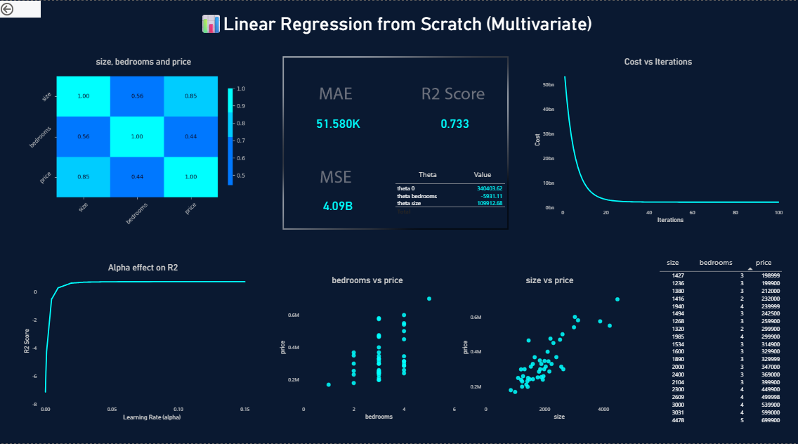
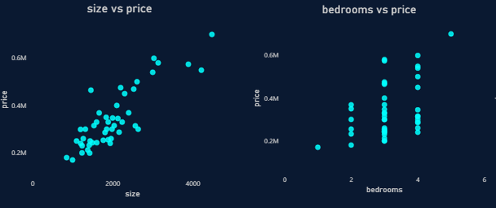

<p align="center">
  
  
  
</p>

# 📊 Gradient Descent Optimization Dashboard

An interactive **Power BI dashboard** visualizing how **Learning Rate (α)** and **Iterations** affect Multivariate Linear Regression trained using **Gradient Descent From Scratch**.  
Built to demonstrate **model convergence** and **hyperparameter tuning** insights for ML beginners and practitioners.

---

## ✨ Dashboard Features
- R² score vs learning rate and iterations.
- Cost function visualization for convergence tracking.
- Scatter plots showing feature-target relationships.
- Dark theme with neon highlights for better visibility. 
- Fully interactive slicers & tooltips.

---

## 🎬 Dashboard Preview

### 🖥️ Full Dashboard View:


---

### 📈 Scatter Plots:
- Scatter plots showing the relationship between input features and the target variable
- Used to visually assess feature correlation and linearity



---

### 🔺 Learning Rate Effect on R²:
- Shows model performance sensitivity to α changes.


---

### 📉 Cost Function vs. Iterations:
- Visual relationship between learning progress and stability.


---

## 🚀 Get Started

1️⃣ Clone this repository:
```bash
git clone https://github.com/radwanhefny/Gradient-Descent-Optimization-Dashboard.git
```
2️⃣ Open Gradient_Descent_Optimization_Dashboard.pbix using Power BI Desktop.

3️⃣ Explore the visuals & hyperparameter effects 🎛️.

---

## 🗂️ Project Structure
```
Gradient-Descent-Optimization-Dashboard/
├── Gradient_Descent_Optimization_Dashboard.pbix  # Power BI dashboard
├── README.md
└── photos/
      ├── Dashboard.png
      ├── Scatters.png
      ├── Alpha effect on R2.png
      └── Cost vs Iterations.png
```

---

## 🔗 Related Project
This dashboard is part of a complete From-Scratch Multivariate Linear Regression implementation:

➡️ Main ML Project Repo:
https://github.com/radwanhefny/linear-regression-from-scratch-multivariate

---

## 📝 License
This project is licensed under the MIT license - see the LICENSE file for details. 

---

## 📞 Support
If you have questions or need help, feel free to:
- Open an issue on this repository  
- Connect with me on LinkedIn: https://www.linkedin.com/in/radwanhefny  
